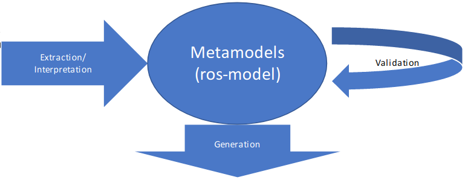

This repository contains examples of generic extensions for RosTooling. The ROStooling toolchain comprises a series of tools, plugins and scripts developed to facilitate the use of [ros-model](http://github.com/ipa320/ros-model), a family of DSLs for the formal description of components and systems developed for the ROS (Robot Operating System) framework. 

The following diagram shows the overview of the RosTooling blocks: 

Within this repository you can find documentation and example of extensions to contribute to RosTooling by developing plugins for each of its blocks. With this concept we aim to establish a federative development process to extend the tooling, which means that anyone can contribute by adding new functionalities to RosTooling but without modifying the core. 

###GENERATION EXTENSIONS

###VALIDATION EXTENSIONS

###EXTRACTION AND INTERPRETATION EXTENSIONS

###METAMODELS (ROS-MODEL) EXTENSIONS
